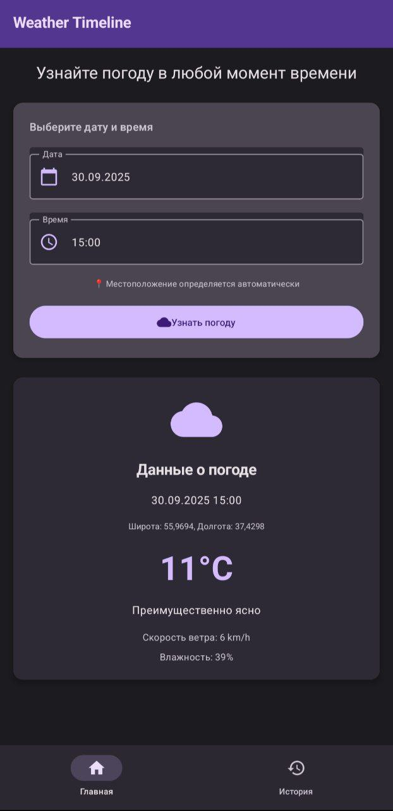
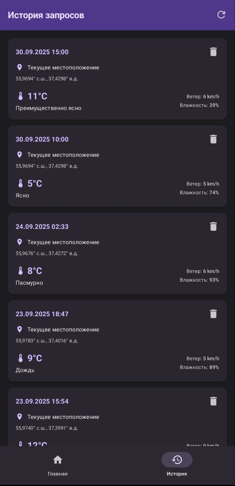

WeatherTimeline - Android-приложение для просмотра исторических и текущих данных о погоде. Приложение позволяет пользователям узнать погодные условия для любой выбранной даты и времени в их текущем местоположении.

## Скриншоты

### Главный экран


### Экран истории запросов


## Основные возможности:
📍 Автоматическое определение местоположения

📅 Выбор произвольной даты и времени

🌤️ Получение детальной погодной информации

📱 Современный Material Design 3 интерфейс

📊 Просмотр истории запросов

## Архитектура приложения
### Технологический стек:
- Язык: Kotlin
- UI: Jetpack Compose + Material 3
- Архитектура: MVVM + Clean Architecture
- Навигация: Navigation Component
- Локация: FusedLocationProviderClient
- Асинхронность: Kotlin Coroutines + Flow
- DI: Koin

### Структура пакетов:
``` text
com.example.weathertimeline/
├── presentation/         # UI слой
│   ├── screens/          # Экраны приложения
│   ├── components/       # Composable компоненты
│   ├── navigation/       # Навигация
│   ├── ui/               # Стили
│   └── utils/            # Вспомогательные классы
├── domain/               # Доменный слой
│   ├── model/            # Модели данных
│   ├── repository/       # Интерфейсы репозиториев
│   └── usecase/          # Use Cases
├── data/                 # Data слой
│   ├── api/              # API погоды
│   ├── local/            # База данных
│   ├── model/            # Модели данных
│   └── repository/       # Реализации репозиториев
└── di/                   # Зависимости
```
